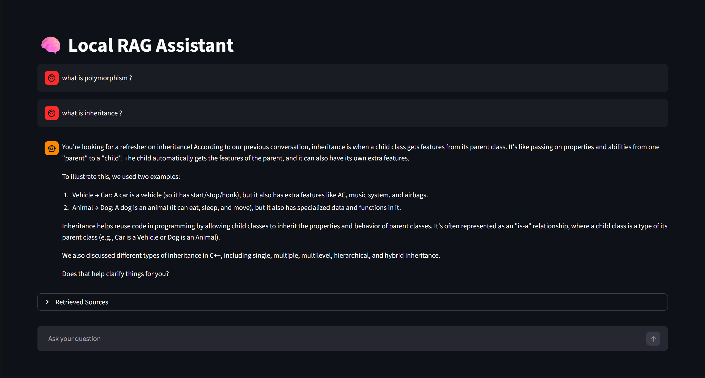

# 🧠 Local RAG Research Assistant

A fully local Retrieval-Augmented Generation (RAG) assistant built using:

- Ollama
- ChromaDB
- Sentence Transformers
- Streamlit

Supports:
- PDF/TXT ingestion
- Semantic search
- Conversational memory
- Local LLM inference
- Research-style document querying

---

# 🚀 Features

- Fully Local AI System
- Multi-document RAG Pipeline
- PDF + TXT Support
- Semantic Search using Embeddings
- ChromaDB Vector Storage
- Ollama Local LLM Integration
- Streamlit Chat Interface
- Conversational Memory
- Source Retrieval Display
- Automatic File Ingestion

---

# 🏗️ Architecture

```text
Documents
   ↓
Chunking
   ↓
Embeddings
   ↓
ChromaDB
   ↓
Retriever
   ↓
Ollama (LLM)
   ↓
Final Answer
```

---

# 📂 Project Structure

```text
local-rag-assistant/
│
├── data/
│   ├── sample.pdf
│   ├── notes.txt
│   └── ...
│
├── chroma_db/
│
├── app.py
├── ingest.py
├── query.py
├── requirements.txt
├── README.md
└── .gitignore
```

---

# ⚙️ Installation

## 1. Clone Repository

```bash
git clone https://github.com/yourusername/local-rag-assistant.git

cd local-rag-assistant
```

---

## 2. Create Virtual Environment

### Windows

```bash
python -m venv venv

venv\Scripts\activate
```

### Linux / Mac

```bash
python3 -m venv venv

source venv/bin/activate
```

---

## 3. Install Dependencies

```bash
pip install -r requirements.txt
```

---

# 📦 Required Dependencies

```txt
streamlit
chromadb
sentence-transformers
ollama
pypdf
langchain-text-splitters
```

---

# 🦙 Install Ollama

Download Ollama:

https://ollama.com/download

---

# 📥 Pull Local LLM

```bash
ollama pull llama3
```

Optional better research model:

```bash
ollama pull qwen2.5
```

---

# 📄 Add Your Documents

Place all PDFs or TXT files inside:

```text
data/
```

Example:

```text
data/
 ├── oop_notes.pdf
 ├── ai_research.pdf
 ├── dsa_notes.txt
 └── ml_book.pdf
```

---

# 🧠 Ingest Documents

Run:

```bash
python ingest.py
```

This process:
- reads all files
- chunks documents
- creates embeddings
- stores vectors in ChromaDB

Expected output:

```text
SUCCESS: Stored XXXX chunks!
```

---

# 💬 Run Streamlit App

```bash
streamlit run app.py
```

Browser opens automatically:

```text
http://localhost:8501
```

---

# ❓ Example Questions

- Explain inheritance in OOP
- What is polymorphism?
- Summarize chapter 2
- Compare stacks vs queues
- Explain linked lists
- What are transformer architectures?
- Explain RAG systems

---

# 🔍 How It Works

## 1. Document Ingestion

Documents are:
- loaded
- chunked
- embedded

using Sentence Transformers.

---

## 2. Vector Storage

Embeddings are stored in ChromaDB for semantic retrieval.

---

## 3. Query Processing

When user asks a question:

- query gets embedded
- relevant chunks retrieved
- chunks passed to Ollama
- final grounded answer generated

---

# 🧠 Embedding Model

Default:

```python
BAAI/bge-base-en
```

Can be changed inside:

```text
ingest.py
app.py
```

---

# 🤖 Supported Ollama Models

Recommended:

- llama3
- qwen2.5
- mistral
- phi3

---

# 📚 Tech Stack

- Python
- Streamlit
- Ollama
- ChromaDB
- Sentence Transformers
- LangChain Text Splitters

---

# 🔮 Future Improvements

- Hybrid Search
- Reranking
- Streaming Responses
- PDF Upload from UI
- Source Citations with Page Numbers
- Agentic Retrieval
- Multi-user Support
- Voice Interface
- Research Agent Workflows

---

# 🛠️ .gitignore

```gitignore
venv/
.venv/
chroma_db/
__pycache__/
*.pyc
.env
.DS_Store
```

---

# 📸 Screenshots




# 🧪 Example Workflow

```text
1. Add PDFs or any data -->> to /data
2. Run ingest.py
3. Start Streamlit app
4. Ask questions
5. Retrieve grounded answers
```

---

# 📌 GitHub Topics

Recommended topics:

```text
rag
ollama
streamlit
llm
chromadb
ai
retrieval-augmented-generation
local-llm
semantic-search
```

---

# 📜 License

MIT License

---

# ⭐ Acknowledgements

Built using:
- Ollama
- ChromaDB
- Sentence Transformers
- Streamlit
- Open-source AI ecosystem